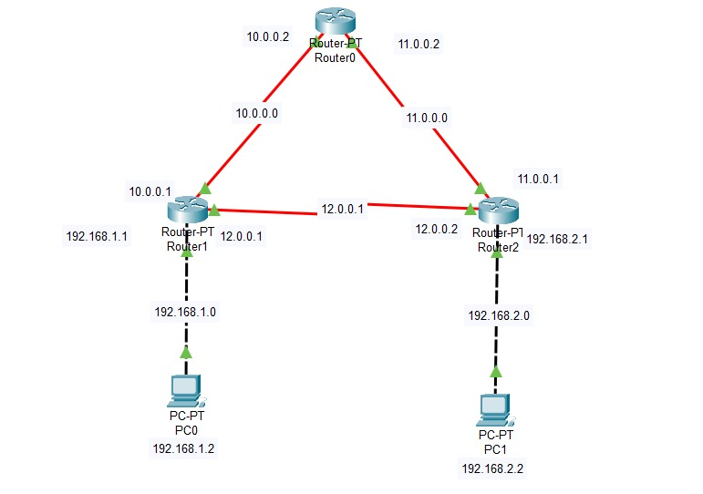

# 🔐 OSPF Multi-Router Topology (Cisco Packet Tracer)

## 📌 Overview

This lab demonstrates the configuration and implementation of the **OSPF (Open Shortest Path First)** routing protocol across a multi-router network using Cisco Packet Tracer.

The goal of this project is to establish dynamic routing between multiple networks and ensure full connectivity using **OSPF Area 0 (Backbone Area)**.

---

## 🎯 Objectives

* Configure OSPF on multiple routers
* Establish neighbor relationships between routers
* Enable communication between different subnets
* Understand OSPF Area 0 backbone routing

---

## 🌐 Network Topology



### 🧩 Network Details

| Device   | Interface IP                    |
| -------- | ------------------------------- |
| Router 0 | 10.0.0.2, 11.0.0.2              |
| Router 1 | 10.0.0.1, 12.0.0.1, 192.168.1.1 |
| Router 2 | 11.0.0.1, 12.0.0.2, 192.168.2.1 |
| PC0      | 192.168.1.2                     |
| PC1      | 192.168.2.2                     |

---

## ⚙️ OSPF Configuration

### 🔹 Router 0

```bash
enable
configure terminal
router ospf 1
network 10.0.0.0 0.255.255.255 area 0
network 11.0.0.0 0.255.255.255 area 0
exit
```

### 🔹 Router 1

```bash
enable
configure terminal
router ospf 1
network 192.168.1.0 0.0.0.255 area 0
network 10.0.0.0 0.255.255.255 area 0
network 12.0.0.0 0.255.255.255 area 0
exit
```

### 🔹 Router 2

```bash
enable
configure terminal
router ospf 1
network 192.168.2.0 0.0.0.255 area 0
network 11.0.0.0 0.255.255.255 area 0
network 12.0.0.0 0.255.255.255 area 0
exit
```

---

## 🔍 Verification Commands

Use the following commands to verify OSPF configuration:

```bash
show ip ospf neighbor
show ip route
show ip protocols
```

---

## ✅ Results

* OSPF neighbors successfully formed between all routers
* Routing tables dynamically updated
* Full connectivity achieved between:

  * PC0 (192.168.1.2)
  * PC1 (192.168.2.2)

✔️ Ping test successful across networks

---

## 🛠 Tools Used

* Cisco Packet Tracer

---

## 🧠 Key Learnings

* OSPF is a **link-state routing protocol**
* Area 0 acts as the backbone of OSPF networks
* Wildcard masks are used to define network ranges
* Dynamic routing reduces manual configuration effort

---

## 🚀 Future Improvements

* Implement multi-area OSPF
* Add authentication to OSPF
* Introduce VLAN segmentation
* Apply ACLs for traffic control

---

## 👨‍💻 Author

Sylvester Dsouza
Aspiring Cybersecurity Professional

---
